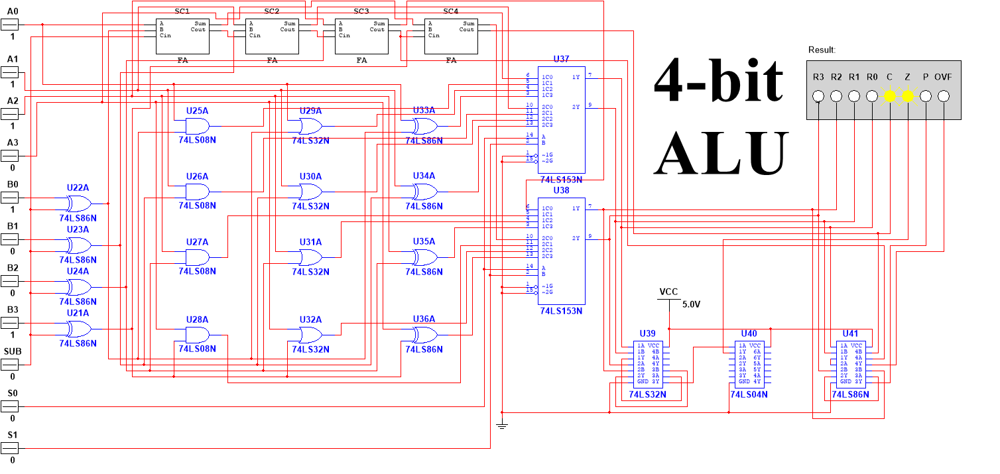
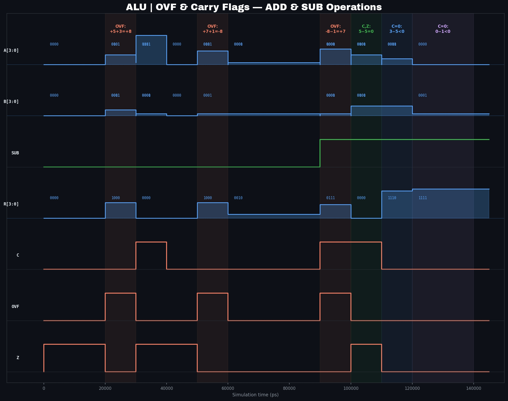

# 4-bit ALU



A fully gate-level 4-bit ALU designed and simulated in NI Multisim, with a complete Verilog RTL port verified through iverilog and GTKWave. Every logic gate in the Verilog mirrors the exact IC placement in the Multisim schematic — no behavioral shortcuts.

---

## What it does

This ALU takes two 4-bit operands **A** and **B**, a subtraction flag **SUB**, and a 2-bit operation select **S[1:0]**, and produces a 4-bit result along with four status flags.

| SUB | S[1:0] | Operation     | Description                         |
|-----|--------|---------------|-------------------------------------|
|  0  |  00    | ADD           | A + B (ripple carry)                |
|  1  |  00    | SUB           | A − B (2's complement)              |
|  0  |  01    | AND           | A AND B (bitwise)                   |
|  0  |  10    | OR            | A OR B (bitwise)                    |
|  0  |  11    | XOR           | A XOR B (bitwise)                   |

### Status Flags

| Flag | Meaning                                                      |
|------|--------------------------------------------------------------|
| C    | Carry out of MSB — unsigned overflow or borrow indicator     |
| Z    | Zero — result is 0000                                        |
| P    | Parity — 1 when result has an odd number of 1-bits           |
| OVF  | Signed overflow — carry into MSB ≠ carry out of MSB         |

> C and OVF are driven by the adder at all times (matching the physical Multisim circuit). They are architecturally meaningful only in arithmetic mode (S=00).

---

## Architecture

The design follows the exact structure of the Multisim schematic:

```
A[3:0] ──XOR(SUB)──► B_sel ──────────────────────────────────┐
                                                               │
                     ┌─────── 4x Full Adder (SC1–SC4) ────────┤──► sum[3:0]
                     │        ripple carry chain               │
                     │        Cin = SUB                        │
                     │                                         │
B[3:0] ──────────────┤──────── AND unit (74LS08N) ────────────┤──► and_out[3:0]
                     │                                         │         │
                     ├──────── OR  unit (74LS32N) ────────────┤──► or_out[3:0]   ──► 74LS153N MUX ──► R[3:0]
                     │                                         │         │               (S[1:0] selects)
                     └──────── XOR unit (74LS86N) ────────────┘──► xor_out[3:0]
                                                               │
                     C   = Cout(FA3)
                     Z   = NOR(R3,R2,R1,R0)          (74LS32N + 74LS04N)
                     OVF = c3_in XOR Cout             (74LS86N)
                     P   = R3 XOR R2 XOR R1 XOR R0    (74LS86N chain)
```

### ICs used in Multisim schematic

| Reference  | IC         | Function                        |
|------------|------------|---------------------------------|
| U21A–U24A  | 74LS86N    | B inversion for subtraction     |
| SC1–SC4    | Custom FA  | 4x Full Adder (ripple carry)    |
| U25A–U28A  | 74LS08N    | AND logic unit                  |
| U29A–U32A  | 74LS32N    | OR logic unit                   |
| U33A–U36A  | 74LS86N    | XOR logic unit                  |
| U37, U38   | 74LS153N   | Dual 4x1 MUX — output select    |
| U39        | 74LS32N    | Zero flag OR chain              |
| U40        | 74LS04N    | Zero flag inverter              |
| U41        | 74LS86N    | OVF and Parity XOR chain        |

---

## Repository Structure

```
4-bit-alu/
├── README.md
├── LICENSE
├── images/
│   ├── architecture.png      — Multisim schematic screenshot
│   ├── waveform_add.png      — ADD operation simulation waveforms
│   └── waveform_overflow.png — OVF and Carry flag waveforms
├── multisim/
│   └── alu.ms14              — Original NI Multisim circuit file
├── rtl/
│   ├── full_adder.v          — Gate-level full adder (XOR/AND/OR primitives)
│   └── alu.v                 — Top-level ALU (mirrors schematic exactly)
├── tb/
│   └── alu_tb.v              — Testbench (25 vectors, VCD dump)
└── sim/
    └── alu.vcd               — Simulation output for GTKWave
```

---

## Simulation Waveforms

### ADD Operation


Five ADD test vectors stepping through: `5+3=8` (OVF), `15+1=0` (C,Z), `0+0=0` (Z), `7+1=8` (signed OVF), `1+1=2` (P).

### OVF and Carry Flags



Focused view of signed overflow and carry/borrow behavior across ADD and SUB operations.

---

## Running the Simulation

Requirements: [iverilog](https://github.com/steveicarus/iverilog), [GTKWave](https://gtkwave.sourceforge.net/)

```bash
# Compile
iverilog -o sim/alu_sim rtl/full_adder.v rtl/alu.v tb/alu_tb.v

# Run — prints pass/fail for each vector, writes sim/alu.vcd
vvp sim/alu_sim

# View waveforms
gtkwave sim/alu.vcd
```

Expected output: **25 passed, 0 failed**

---

## Boolean Expressions

**Full Adder**
```
Sum  = A ⊕ B ⊕ Cin
Cout = (A·B) + (B·Cin) + (A·Cin)
```

**B inversion (2's complement SUB)**
```
B_sel[i] = B[i] ⊕ SUB        (SUB also feeds Cin of FA0)
```

**Zero Flag**
```
Z = ¬(R3 + R2 + R1 + R0)
```

**Overflow Flag**
```
OVF = c3_in ⊕ Cout            (carry into MSB ≠ carry out of MSB)
```

**Parity Flag**
```
P = R3 ⊕ R2 ⊕ R1 ⊕ R0
```

---

## Test Coverage

| Category        | Vectors | What's verified                          |
|-----------------|---------|-------------------------------------------|
| ADD             | 5       | Result, C, Z, P, OVF including edge cases |
| SUB             | 4       | 2's complement, borrow, zero result       |
| AND             | 4       | Bitwise, all-zero, all-one                |
| OR              | 4       | Bitwise, identity cases                   |
| XOR             | 4       | Bitwise, self-cancel, all-ones            |
| Parity          | 4       | 1/2/3/4 set bits covering odd/even cases  |
| **Total**       | **25**  | **25 passed, 0 failed**                   |

---

## Why This Project

Every processor — from the microcontrollers in embedded systems to the FPGAs in high-frequency trading infrastructure — has an ALU at its core. This ALU is that block implemented at 4-bit scale, entirely from discrete logic gates, with the full design visible at the gate level. Understanding arithmetic, overflow, carry propagation, and parity at this level is foundational to low-level systems programming, FPGA development, and hardware-aware software design.

---

## Author

**Muhammad Wali** — [@muhammadwali0](https://github.com/muhammadwali0)

---

## License

This project is licensed under the GNU General Public License v3.0 — see [LICENSE](LICENSE) for details.
